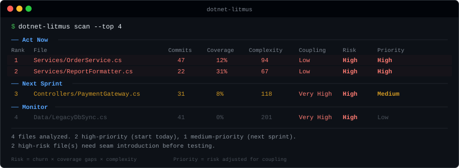

# Litmus

[](https://www.nuget.org/packages/dotnet-litmus)
[](https://www.nuget.org/packages/dotnet-litmus)
[](https://github.com/ebrahim-s-ebrahim/litmus/blob/main/LICENSE)

**You inherited a codebase with 200 files and zero tests. Where do you even start?**

Litmus tells you. Two commands, one ranked list — start testing where it actually matters.

<p align="center">
  
</p>

## Get Started in 30 Seconds

```bash
dotnet tool install --global dotnet-litmus
dotnet-litmus scan
```

That's it. Litmus finds your solution, runs your tests, collects coverage, and hands you a prioritized action plan. No config files, no dashboards, no setup.

**No tests yet?** Even better — that's exactly what Litmus is for:

```bash
dotnet-litmus scan --no-coverage
```

## What You Get

Not another dashboard. Not a wall of warnings. A clear answer to *"what should I test first?"*

```
── Act Now ──────────────────────────────────────────────────────────────────────
Rank  File                           Commits  Coverage  Complexity  Coupling  Risk    Priority
1     Services/OrderService.cs       47       12%       94          Low       High    High
2     Services/ReportFormatter.cs    22       31%       67          Low       High    High

── Next Sprint ──────────────────────────────────────────────────────────────────
3     Controllers/PaymentGateway.cs  31       8%        118         Very High High    Medium

── Monitor ──────────────────────────────────────────────────────────────────────
4     Data/LegacyDbSync.cs           41       0%        201         Very High High    Low

4 files analyzed. 2 high-priority (start today), 1 medium-priority (next sprint).
2 high-risk file(s) need seam introduction before testing.
```

**Act Now** — high risk, low coupling. Write tests today.
**Next Sprint** — high risk, but tangled. Introduce [seams](https://www.oreilly.com/library/view/working-effectively-with/0131177052/) first, then test.
**Monitor** — keep an eye on it, but don't start here.

Notice how `PaymentGateway.cs` has *higher* risk than `OrderService.cs` but lands in "Next Sprint"? That's Litmus telling you: *"Yes, it's dangerous — but it's too entangled to test right now. Introduce seams first."*

That's the insight you can't get from coverage reports alone.

## Why Litmus?

Most tools tell you *what's untested*. Litmus tells you *where to start* — and what's blocking you.

It cross-references **four signals** that no single tool combines:

| Signal | The question it answers |
|---|---|
| 🔄 **Git churn** | Is this file changing often? (high churn = high blast radius) |
| 🧪 **Code coverage** | Is anyone testing it? |
| 🧩 **Cyclomatic complexity** | How many paths can break? |
| 🔗 **Coupling analysis** | Can you actually write a test for it today? |

That last one is the key. Litmus uses **Roslyn** to detect unseamed dependencies — things like `new HttpClient()`, `DateTime.Now`, concrete constructor params — that make a file *impossible* to unit test without refactoring first. Then it adjusts the priority accordingly.

The result: **a ranked list ordered by *practical testability***, not just risk.

## Go Deeper

### Drill into methods

```bash
dotnet-litmus scan --detailed
```

```
1  Services/OrderService.cs   47   12%   94   Low   High  High
     ProcessOrder             —    50%   25
     ValidateInput            —    0%    18
```

See exactly which methods inside a high-risk file need attention first.

### Track progress over time

```bash
dotnet-litmus scan --output baseline.json        # save a snapshot
dotnet-litmus scan --baseline baseline.json       # compare later
```

A **Delta** column shows what improved, what degraded, and what's new.

### Get plain-English explanations

```bash
dotnet-litmus scan --explain
```

### Export and share

```bash
dotnet-litmus scan --output report.html           # shareable HTML with sortable table
dotnet-litmus scan --format json | jq '.[].file'  # pipe JSON to your tools
dotnet-litmus scan --output results.csv            # CSV for spreadsheets
```

## Features at a Glance

- 🔍 **Auto-detects** your solution file — just run from the project root
- ⚡ **One command** does everything — tests, coverage, analysis, report
- 📊 **Grouped output** — Act Now / Next Sprint / Monitor
- 🎯 **Seam detection** — knows when a file is too entangled to test directly
- 📈 **Baseline comparison** — track how test debt changes over time
- 🔬 **Method-level drill-down** — pinpoint the riskiest methods
- 💬 **Plain-English explanations** — `--explain` tells you *why* each file ranks where it does
- 📄 **Multiple formats** — table, JSON, CSV, HTML
- 🚦 **CI quality gate** — `--fail-on-threshold` breaks the build on risk regressions
- 🧰 **Flexible coverage** — works with coverlet or dotnet-coverage
- 🚫 **No tests? No problem** — `--no-coverage` works without any test projects

## CI/CD Integration

Litmus fits naturally into CI pipelines. Track test debt over time, catch regressions, and share reports with the team.

```yaml
# .github/workflows/litmus.yml
- name: Install Litmus
  run: dotnet tool install --global dotnet-litmus

- name: Run analysis
  run: dotnet-litmus scan --output report.json --quiet

- name: Quality gate
  run: dotnet-litmus scan --fail-on-threshold 1.0 --quiet
```

> **Important:** Use `fetch-depth: 0` in your checkout step — Litmus needs full git history for churn analysis.

<details>
<summary>Full GitHub Actions example with baseline tracking</summary>

```yaml
name: Litmus Analysis
on: [push]

jobs:
  litmus:
    runs-on: ubuntu-latest
    steps:
      - uses: actions/checkout@v4
        with:
          fetch-depth: 0

      - uses: actions/setup-dotnet@v4
        with:
          dotnet-version: '8.0.x'

      - name: Install Litmus
        run: dotnet tool install --global dotnet-litmus

      - name: Download previous baseline
        uses: actions/download-artifact@v4
        with:
          name: litmus-baseline
        continue-on-error: true

      - name: Run analysis
        run: |
          if [ -f baseline.json ]; then
            dotnet-litmus scan --output report.json --baseline baseline.json
          else
            dotnet-litmus scan --output report.json
          fi

      - name: Save as next baseline
        uses: actions/upload-artifact@v4
        with:
          name: litmus-baseline
          path: report.json
```

</details>

| CI flag | Purpose |
|---|---|
| `--quiet` | Suppress console output — only exit code and file export |
| `--output report.json` | Machine-readable export |
| `--output report.html` | Shareable HTML report |
| `--baseline previous.json` | Detect regressions between runs |
| `--fail-on-threshold 1.0` | Fail the build if any file exceeds a risk score |
| `--no-color` | Clean logs without ANSI codes |

## How It Works

Litmus analyzes your codebase in two phases:

**Phase 1 — Risk Score:** How dangerous is it to leave this file untested?

```
RiskScore = Churn × (1 - Coverage) × (1 + Complexity)
```

**Phase 2 — Starting Priority:** Can you actually test it today?

```
StartingPriority = RiskScore × (1 - Coupling)
```

A file with `Very High` coupling gets its priority *reduced* — not because it's safe, but because you need to introduce seams before you can test it. High risk + low coupling = start here.

> For the full scoring methodology, seam detection signals, and architecture details, see [ARCHITECTURE.md](ARCHITECTURE.md).

## How is this different from SonarQube?

SonarQube monitors code quality. Litmus answers a different question: *"I just inherited this codebase — where do I start testing?"*

| | SonarQube | Litmus |
|---|---|---|
| **Goal** | Broad code quality monitoring | Prioritized test starting list |
| **Signals** | Static analysis rules, coverage % | Git churn + coverage + complexity + seam detection |
| **Output** | Dashboard of issues | Ranked action plan: start here, plan next, introduce seams first |
| **Setup** | Server, database, CI integration | `dotnet tool install`, run from terminal |
| **Delta tracking** | Paid tier for branch analysis | `--baseline` flag (free, built-in) |
| **Cost** | Free tier limited; paid for full | Free and open source |

They complement each other well. Use SonarQube for ongoing quality gates; use Litmus to prioritize where to invest testing effort.

## CLI Reference

### Commands

| Command | Description |
|---|---|
| `dotnet-litmus scan` | Run tests, collect coverage, and analyze — all in one step |
| `dotnet-litmus analyze` | Analyze using an existing Cobertura XML coverage file |

### Options

<details>
<summary>Shared options (both commands)</summary>

| Option | Default | Description |
|---|---|---|
| `--solution` | auto-detect | Path to `.sln` or `.slnx` |
| `--since` | 1 year ago | Git history cutoff (e.g., `2025-01-01`) |
| `--top` | 20 | Number of files to display |
| `--exclude` | — | Glob pattern(s) to exclude (repeatable) |
| `--output` | — | Export to `.json`, `.csv`, or `.html` |
| `--baseline` | — | Previous JSON export for delta comparison |
| `--format` | table | Stdout format: `table`, `json`, `csv`, `html` |
| `--detailed` | false | Method-level drill-down for top files |
| `--explain` | false | Plain-English annotations per file |
| `--no-group` | false | Flat table instead of grouped output |
| `--verbose` | false | Show intermediate scores |
| `--quiet` | false | Suppress all output except errors |
| `--fail-on-threshold` | — | Exit code 1 if any score exceeds this (0.0–2.0) |
| `--no-color` | false | Disable colored output |

</details>

<details>
<summary>scan-only options</summary>

| Option | Default | Description |
|---|---|---|
| `--tests-dir` | solution dir | Directory or project for `dotnet test` |
| `--no-coverage` | false | Skip tests — analyze by churn, complexity, and coupling only |
| `--coverage-tool` | coverlet | Coverage collector: `coverlet` or `dotnet-coverage` |
| `--timeout` | 10 | Max minutes for test execution |

</details>

<details>
<summary>analyze-only options</summary>

| Option | Default | Description |
|---|---|---|
| `--coverage` | *required* | Path to Cobertura XML coverage file |

</details>

## Installation

```bash
# From NuGet (recommended)
dotnet tool install --global dotnet-litmus

# From a local build
dotnet pack Litmus/Litmus.csproj -c Release
dotnet tool install --global --add-source Litmus/bin/Release dotnet-litmus

# Or run without installing
dotnet run --project Litmus -- scan
```

### Prerequisites

- [.NET 8 SDK](https://dotnet.microsoft.com/download) or later (.NET 9, .NET 10 supported)
- **git** on PATH
- For `scan`: test projects need [`coverlet.collector`](https://www.nuget.org/packages/coverlet.collector) (or use `--coverage-tool dotnet-coverage`)
- For `scan --no-coverage`: no test setup needed at all

## Troubleshooting

<details>
<summary>No solution file found</summary>

Run from the directory with your `.sln`/`.slnx`, or specify it explicitly:

```bash
dotnet-litmus scan --solution path/to/MyApp.sln
```

</details>

<details>
<summary>Tests fail and no coverage is generated</summary>

Coverage can't be collected from failed test runs. Fix failing tests first.

If tests pass but no coverage appears, add the coverlet collector:

```bash
dotnet add <test-project> package coverlet.collector
```

Or switch to `dotnet-coverage` (no package reference needed):

```bash
dotnet tool install --global dotnet-coverage
dotnet-litmus scan --coverage-tool dotnet-coverage
```

</details>

<details>
<summary>Scan hangs during test execution</summary>

Usually caused by coverlet. Try in order:

1. Switch to `dotnet-coverage`: `dotnet-litmus scan --coverage-tool dotnet-coverage`
2. Upgrade `coverlet.collector` to latest
3. Increase timeout: `dotnet-litmus scan --timeout 30`
4. Generate coverage separately and use `analyze`

</details>

<details>
<summary>Default file exclusions</summary>

These patterns are always excluded to filter auto-generated noise:

`*.Designer.cs`, `*.g.cs`, `*.g.i.cs`, `*.generated.cs`, `*AssemblyInfo.cs`, `*GlobalUsings.g.cs`, `*.xaml.cs`, `**/Migrations/*.cs`, `*ModelSnapshot.cs`, `Program.cs`, `Startup.cs`, `**/obj/**`, `**/bin/**`, `**/wwwroot/**`

Add more with `--exclude`.

</details>

## Exit Codes

| Code | Meaning |
|---|---|
| `0` | Success |
| `1` | Error — validation failure, test failure, runtime error, or `--fail-on-threshold` exceeded |

## Contributing

Contributions are welcome! Here's how to get started:

```bash
git clone https://github.com/ebrahim-s-ebrahim/litmus.git
cd litmus
dotnet build Litmus.slnx
dotnet test Litmus.slnx
```

Litmus eats its own dog food — the CI pipeline runs `dotnet-litmus analyze` on itself after every push.

Before submitting a PR:
- Run `dotnet test Litmus.slnx` and ensure all tests pass
- If adding a new feature, include tests in `Litmus.Tests/`
- Keep the architecture documented — see [ARCHITECTURE.md](ARCHITECTURE.md)

## License

[MIT](LICENSE)
